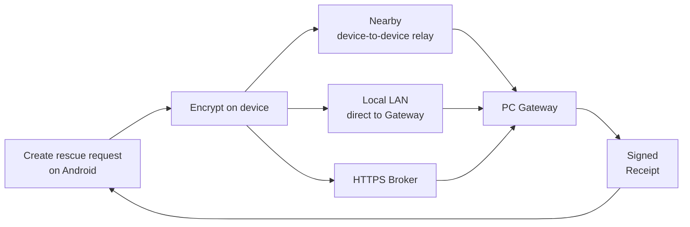

<div align="center">


# Relay

### Keep rescue information moving when connectivity fails.

**Relay is an open-source disaster-communication project that encrypts rescue information on Android devices and relays it through available paths — Nearby, local LAN, or an HTTPS Broker — toward a PC Gateway at a rescue coordination point.**

[](https://github.com/heynegix/Relay/actions/workflows/relay-ci.yml)
[](#development-environment)
[](#development-environment)
[](LICENSE)
[](#project-status)

[Overview](#relay-in-30-seconds) · [Screenshots](#screenshots) · [Status](#project-status) · [Quick start](#quick-start) · [Architecture](#how-relay-works) · [Verification](#verification) · [Security](#security-model) · [Contributing](#contributing) · [Roadmap](ROADMAP.md) · [Docs](#documentation)

</div>

> [!CAUTION]
> **Relay does not replace 119, fire departments, police, municipalities, or any official emergency communication channel.**
> Relay is currently a development-stage project intended for development, evacuation drills, limited collaborative pilots, and technical validation. A UI state such as “saved,” “relaying,” or “received” does **not** guarantee emergency dispatch, responder acknowledgement, or rescue.

---

## Relay in 30 seconds

During a large-scale disaster, **a smartphone may still work while internet access or cellular infrastructure becomes unstable or unavailable**.

Relay avoids relying on a single transport path. Instead, it is designed to move encrypted rescue information through whichever supported route is available.



Relay is built around three principles:

- **Local-first** — use multiple available paths, including Nearby and LAN, instead of assuming internet connectivity.
- **Encrypted relay** — rescue content is encrypted on Android; intermediate relay devices and the Broker are not intended to decrypt it.
- **Honest delivery state** — a successful transport operation is not treated as proof that a rescue coordination point received the request.

The goal is not to make communication *look* successful. The goal is to represent **how far a request has actually progressed** as honestly as possible.

### Why open source?

Relay handles sensitive communication and failure-prone transport boundaries. Keeping the source, protocol rules, readiness evidence, and limitations public lets independent developers inspect the design, reproduce tests, report security issues, and contribute validation without confusing automated tests with real-world readiness.

---

## Screenshots

| Android home | Rescue request | Official information |
|---|---|---|
|  |  |  |

---

## Project status

Relay currently includes an Android application, a PC Gateway, an HTTPS Broker, local drill features, and automated security and quality checks. It is a **development preview**, not a production emergency service.

> **Implemented ≠ tested on physical devices ≠ field-ready.**

| Area | Current state |
|---|---|
| Android rescue flow | Implemented with automated tests. End-to-end validation on physical Android devices is still required. |
| Nearby / LAN / Broker delivery | Implemented with automated tests. Multi-device, RF, and real-network validation is still required. |
| PC Gateway | Staff UI, audit records, signed receipts, drill features, and retention handling are implemented. Field operation remains unvalidated. |
| Gateway enrollment | QR scanning, pasted enrollment data, fingerprint confirmation, and explicit key rotation are implemented. Physical-device and real-LAN validation is required. |
| Security & quality | Includes CodeQL, secret scanning, dependency verification, fuzzing, API contract tests, load tests, and failure-path testing. |
| Production operation | **Not reached.** Production keys, physical-device validation, operational ownership, infrastructure, privacy review, and legal decisions are still required. |

The machine-readable source of truth for readiness is [`docs/readiness/status.yml`](docs/readiness/status.yml). Code changes do not automatically promote a feature to `DEVICE_TESTED` or `FIELD_TESTED` without corresponding evidence.

<details>
<summary><strong>Generated readiness snapshot</strong></summary>

<!-- BEGIN GENERATED: readiness-summary (tools/readiness/readiness_tool.py; edit docs/readiness/status.yml instead) -->
> [!NOTE]
> This section is generated from `docs/readiness/status.yml`, the single source of truth. Do not edit it by hand.
>
> **Readiness snapshot: 2026-09-16 / commit `3af3538` / branch `main`**
>
> Tracked features: 50 total; 46 implemented; 3 not implemented; 43 automatically tested; 1 emulator-tested; **0 device-tested / 0 field-tested**; 7 with external decisions or blockers.
>
> `IMPLEMENTED` and `AUTOMATED_TESTED` never mean `DEVICE_TESTED` or `FIELD_TESTED`. See the [readiness table](docs/readiness/READINESS_TABLE.md), [open items](docs/readiness/OPEN_ITEMS.md), and [readiness summary](docs/readiness/MUNICIPAL_SUMMARY.md) for the per-feature evidence.
<!-- END GENERATED: readiness-summary -->

</details>

> [!IMPORTANT]
> Relay must **not** currently be described as `DEVICE_TESTED`, `FIELD_READY`, `PILOT_READY`, or `PRODUCTION_READY`.

---

## Quick start

### Run the local pilot on Windows

From the repository root:

```powershell
.\scripts\Start-Relay-Local-Pilot.ps1
```

Then open:

- Participant intake: `http://127.0.0.1:8080/local-pilot`
- Staff console: `http://127.0.0.1:8080/`

Validate and stop the local pilot with:

```powershell
.\scripts\Test-Relay-Local-Pilot.ps1
.\scripts\Stop-Relay-Local-Pilot.ps1
```

Only use `-AllowLan` when you explicitly want drill devices on the same LAN to connect:

```powershell
.\scripts\Start-Relay-Local-Pilot.ps1 -AllowLan
```

> [!WARNING]
> Local pilot features, debug APKs, unsigned installers, free tunnels, and similar development tools are for **development, drills, and validation only**. Do not use them as production emergency communication infrastructure.

### Build from source

```bash
git clone https://github.com/heynegix/Relay.git
cd Relay
```

Windows / PowerShell:

```powershell
.\gradlew.bat :app:assembleLocalDev :pc-gateway:installDist :broker:build
```

Android APK:

```text
app/build/outputs/apk/localDev/app-localDev.apk
```

To build with a Broker endpoint:

```powershell
.\gradlew.bat :app:assembleLocalDev -Prelay.broker.endpoint=https://your-domain.example
```

The endpoint must use HTTPS and include a host. Do not embed credentials in the URL.

For Broker validation over a mobile network, see [HTTPS Broker deployment](deployment/broker/README.md).

---

## How Relay works

### Android app

- Create SOS and standard rescue requests.
- Update, cancel, and inspect request state.
- Update location only after explicit user consent.
- Store data using Room + SQLCipher and Android Keystore-backed protection.
- Relay data using Nearby with a Store-Carry-Forward model.
- Authorize signed Envelope updates and reject state downgrades.
- Enroll a PC Gateway through QR scanning or pasted enrollment data.
- Manage background relay states such as `ARMED`, `EMERGENCY_ACTIVE`, and `DEGRADED`.

> [!NOTE]
> `ARMED` does not mean Nearby is continuously active or that Relay automatically detects disasters. It represents a stored standby configuration.

### PC Gateway

- Individual staff accounts with `ADMIN`, `OPERATOR`, and `VIEWER` roles.
- Receive, assign, process, complete, and audit rescue requests.
- Issue Gateway-signed receipts.
- Preserve assignment state across request updates.
- Store requests without location and later accept consented location updates.
- Display official-information provenance, acquisition path, and verification state.
- Apply retention rules to personal and rescue information.

### HTTPS Broker

- Temporarily relay encrypted Envelopes, public Manifests, and Receipts.
- Keep rescue content opaque to the Broker.
- Apply deduplication, TTLs, and scoped credentials.
- Participate in API contract, load, and failure-path testing.

### Local pilot features

| Feature | Purpose | Limitation |
|---|---|---|
| **PUERTA** | Register drill requests from a browser. | Success means only that the request was stored on this PC. |
| **PONTE** | Register staff observations and drill CSV data. | CSV-derived information remains unverified. |
| **ÉCART** | Organize unverified items, missing information, and verification priority. | Does not automatically classify people as missing, injured, deceased, or dispatched-to. |
| **ANTICIPO Lite** | Track limited support flags such as mobility and power needs. | Does not store diagnoses, medication, or government identifiers. |
| **MOSAIK** | Distinguish Local Web / LAN / Nearby / Broker / Receipt paths. | Does not expose ciphertext or personal information in history views. |

Local pilot pages and APIs are disabled in the production profile. Dedicated Android drill presentation and storage separation remain future work.

---

## Delivery states are intentionally different

Relay does not treat a successful communication API call as proof that a rescue coordination point received a request.

| State | Meaning |
|---|---|
| **Saved on this device** | Stored locally; it may not have left the device yet. |
| **Relaying through nearby devices** | In transit between devices; no rescue-point confirmation yet. |
| **Stored at the rescue point** | A signed Receipt from the PC Gateway has been verified. |
| **Accepted / In progress / Completed by staff** | A Gateway-signed staff handling state has been verified. |

Nearby transfer completion, a peer ACK, HTTP `2xx`, Broker storage, or browser intake completion alone does **not** mean that staff accepted the request or that rescue activity began.

---

## Security model

| Boundary | Design approach |
|---|---|
| Rescue content | Encrypt on Android before storage or transfer. Relay devices and the Broker are not intended to decrypt it. |
| Gateway enrollment | Scanning a QR code alone is insufficient; fingerprint confirmation is required. |
| PC Gateway | Binds to loopback by default. LAN exposure requires an explicit action. |
| Windows private keys | Optional DPAPI protection can bind secrets to the same Windows user and PC. |
| Drill intake | Disabled in production; validates same-origin behavior, size, format, and rate limits. |
| Official information | Shows provenance and verification state instead of claiming authenticity without a trust anchor. |

Windows DPAPI is optional. The default owner-only local file model is **not** equivalent to hardware-backed HSM, TPM, or KMS key protection.

Major automated checks include:

- CodeQL for Java/Kotlin, JavaScript/TypeScript, and GitHub Actions.
- gitleaks secret scanning.
- actionlint and zizmor workflow checks.
- Gradle dependency verification and wrapper hash checks.
- Dependency Review, Dependabot, and OpenSSF Scorecard.
- Jazzer / ClusterFuzzLite decoder fuzzing.
- Property-based tests, mutation tests, and ArchUnit checks.
- OpenAPI 3.1 + Schemathesis Broker API contract checks.
- Broker resilience checks using Toxiproxy and concurrent load tests.

**The existence of automated checks does not prove safe behavior on every physical device, network, or field environment.**

---

## Verification

### Windows validation suite

```powershell
.\scripts\validate-windows-development.ps1
```

Results are classified as `PASS`, `FAIL`, `BLOCKED`, or `NOT_RUN` and written to:

```text
artifacts/windows-validation-report.json
```

For strict release-oriented validation:

```powershell
.\scripts\validate-windows-development.ps1 -Strict
```

### Readiness consistency

```powershell
python tools/readiness/readiness_tool.py validate
python tools/readiness/readiness_tool.py generate
python tools/readiness/readiness_tool.py check
```

### Selected checks

<details>
<summary><strong>Show commands</strong></summary>

JVM / Android unit / Gateway / Broker:

```powershell
.\gradlew.bat :shared:jvmTest :relay-protocol:test :app:testDebugUnitTest :pc-gateway:test :broker:test
```

Android 6.0-equivalent API 23 classic AVD:

```powershell
.\scripts\android-test\run-api23-smoke.ps1
```

API 36 Managed Device:

```powershell
.\gradlew.bat :app:mediumPhoneApi36DebugAndroidTest
```

Staff console E2E:

```bash
cd staff-console-e2e
npm ci
npx playwright install chromium
npm test
```

APK reproducibility:

```powershell
.\scripts\verify-build-reproducibility.ps1
```

</details>

---

## What is still required before real-world operation

1. **Physical-device and RF validation** — multiple Android devices, multi-hop Nearby, BLE, reboot behavior, Doze, battery-saving modes, battery usage, and thermal behavior.
2. **Production trust data** — Regional Root, signed Shelter Directory data, Gateway keys, and fingerprint-verification procedures.
3. **Production infrastructure** — TLS, DNS, monitoring, backups, Broker HA, RTO/RPO targets, and failure drills.
4. **Operations and privacy** — retention, deletion, consent, responsibility boundaries, staff training, legal review, insurance, and communications-regulation review.
5. **Production distribution** — organizational Android signing, Windows Authenticode, release approval, and installation validation on representative devices.

See [OPEN_ITEMS](docs/readiness/OPEN_ITEMS.md) and [BLOCKED_BY_EXTERNAL_DECISIONS](docs/readiness/BLOCKED_BY_EXTERNAL_DECISIONS.md) for the complete lists.

---

## Contributing

Start with [`CONTRIBUTING.md`](CONTRIBUTING.md), which documents the supported development environment, checks, branch/commit/PR expectations, security handling, and the evidence required for device or readiness changes.

Relay currently benefits more from **independent validation on physical devices, real networks, and realistic operating conditions** than from simply adding more features.

Especially useful contributions include:

- Reproducing Nearby / LAN delivery across multiple Android devices.
- Reporting behavior across device vendors, Android versions, and battery-saving configurations.
- Reviewing the UI/UX from an evacuation-drill perspective.
- Reviewing PC Gateway setup and operational procedures.
- Reviewing privacy, key management, failure handling, and data retention.
- Reporting bugs, adding tests, improving documentation, and submitting pull requests.

Found a problem? Open an [Issue](https://github.com/heynegix/Relay/issues) using the appropriate template. For security issues, do **not** post sensitive details publicly; follow the [Security Policy](SECURITY.md). Planned work and safe starter tasks are tracked in [`ROADMAP.md`](ROADMAP.md) and GitHub Issues.

---

## Development environment

- JDK 17
- Android SDK / API 36
- Git
- Windows installer: WiX 3
- Broker container: Docker Compose
- Browser E2E: Node.js

Key versions:

- Kotlin `2.3.21`
- Android Gradle Plugin `9.3.0`
- Gradle `9.5.0`
- Android min SDK `23`
- Android target / compile SDK `36`

---

## Documentation

### Start here

- [Municipal readiness summary](docs/readiness/MUNICIPAL_SUMMARY.md)
- [Full readiness table](docs/readiness/READINESS_TABLE.md)
- [Open and externally blocked items](docs/readiness/OPEN_ITEMS.md)
- [Release evidence index](docs/readiness/RELEASE_EVIDENCE.md)

### Features & operations

- [Background relay mode](docs/BACKGROUND_RELAY_MODE.md)
- [Nearby implementation](docs/NEARBY_IMPLEMENTATION.md)
- [PC Gateway setup](docs/PC_GATEWAY_SETUP.md)
- [PC Gateway security](docs/PC_GATEWAY_SECURITY.md)
- [Local pilot ingress](docs/LOCAL_PILOT_INGRESS.md)
- [HTTPS Broker deployment](deployment/broker/README.md)
- [Field acceptance test](docs/runbooks/FIELD_ACCEPTANCE_TEST.md)

### Security & API

- [Security Policy](SECURITY.md)
- [Threat model](docs/security/THREAT_MODEL.md)
- [Security architecture](docs/security/SECURITY_ARCHITECTURE.md)
- [Trust boundaries](docs/security/TRUST_BOUNDARIES.md)
- [Dependency verification](docs/security/DEPENDENCY_VERIFICATION.md)
- [Branch protection](docs/security/BRANCH_PROTECTION.md)
- [Broker OpenAPI 3.1](docs/api/broker-openapi.yaml)

<details>
<summary><strong>Repository structure</strong></summary>

```text
app/                  Android application
shared/               Shared models, crypto, and trust contracts
relay-protocol/       Gateway wire protocol
pc-gateway/           PC Gateway, staff console, and local pilot
broker/               HTTPS Broker
deployment/broker/    Broker deployment configuration
pc-ble-bridge/        Windows BLE sidecar
fuzz-jvm/             Decoder fuzz targets
staff-console-e2e/    Browser E2E tests
scripts/              Build, startup, validation, and release tools
tools/readiness/      Readiness validation and document generation
docs/                 Design notes, audits, and runbooks
```

</details>

---

## License

Relay is available under the [Apache License 2.0](LICENSE).
