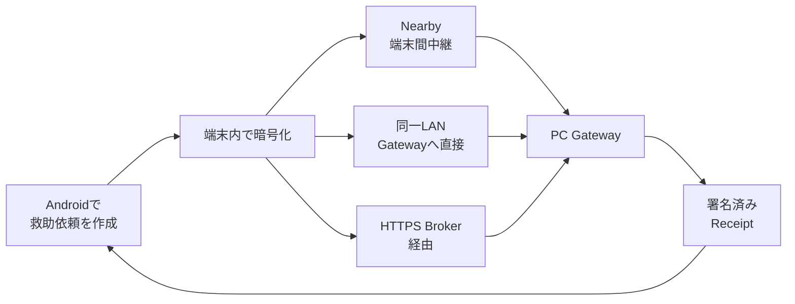

<div align="center">


# Relay

### 通信が途切れても、救助情報をつなぐ。

**Relayは、Android端末で暗号化した救助情報を、Nearby・LAN・HTTPS Brokerなど利用可能な経路で中継し、救助拠点側のPC Gatewayへ届けることを目指すオープンソースの災害時通信プロジェクトです。**

[](https://github.com/NEGI46/Relay/actions/workflows/relay-ci.yml)
[](#開発環境)
[](#開発環境)
[](LICENSE)
[](#現在の状態)

[30秒で理解](#30秒でわかるrelay) ・ [画面](#画面) ・ [現在の状態](#現在の状態) ・ [試す](#まず試す) ・ [仕組み](#relayの仕組み) ・ [検証](#検証) ・ [協力](#relayに協力する) ・ [資料](#主要ドキュメント)

</div>

> [!CAUTION]
> **Relayは119、消防・警察・自治体の公式な緊急連絡手段を置き換えません。**
> 現在は個人開発・避難訓練・限定的な共同実証・技術検証に向けた開発段階です。画面に「保存」「中継」「受信」などと表示されても、救助隊の出動や人命救助を保証するものではありません。

---

## 30秒でわかるRelay

大規模災害では、**スマートフォン自体は動いていても、インターネットや基地局への接続が不安定になる**可能性があります。

Relayは、そのような状況でも情報を1本の通信経路だけに依存させず、使える経路を組み合わせて救助情報を運ぶことを目指しています。



**ポイントは3つです。**

- **Local-first** — インターネットだけに依存せず、NearbyやLANを含む複数経路を扱う
- **Encrypted relay** — 救助本文はAndroid側で暗号化し、中継端末やBrokerは本文を復号しない
- **Honest delivery state** — 「送信処理が成功した」と「救助拠点に届いた」を同じ意味として扱わない

Relayは「通信できた気がする」ことではなく、**どこまで届いたかを区別して扱うこと**を重視しています。

---

## 画面

| Androidホーム | 救助依頼 | 公式情報 |
|---|---|---|
|  |  |  |

---

## 現在の状態

RelayにはAndroidアプリ、PC Gateway、HTTPS Broker、訓練向けローカル実証機能、各種セキュリティ・品質検査が実装されています。

ただし、**実装済み = 実機で確認済み = 現地で使える、ではありません。**

| 領域 | 現在地 |
|---|---|
| Android救助フロー | 実装・自動試験あり。実Android端末での総合確認が必要 |
| Nearby / LAN / Broker配送 | 実装・自動試験あり。複数実機・実電波環境・実回線での検証が必要 |
| PC Gateway | staff画面、監査、署名Receipt、訓練機能、保存期間管理などを実装。現地運用は未検証 |
| Gateway登録 | QR読取、貼付入力、fingerprint確認、明示的な鍵rotationを実装。実機・実LAN確認が必要 |
| セキュリティ・品質 | CodeQL、秘密情報scan、依存関係検証、fuzz、API契約、負荷・障害系などの検査基盤あり |
| 正式運用 | **未到達**。正式鍵、実機試験、運用責任者、本番インフラ、privacy・法務等の判断が必要 |

readinessの唯一の機械可読な正は [`docs/readiness/status.yml`](docs/readiness/status.yml) です。コードが更新されても、実機・現地検証の証拠がなければ自動的に`DEVICE_TESTED`や`FIELD_TESTED`にはなりません。

<details>
<summary><strong>readiness集計を表示</strong></summary>

<!-- BEGIN GENERATED: readiness-summary (tools/readiness/readiness_tool.py; edit docs/readiness/status.yml instead) -->
> [!NOTE]
> この節は `docs/readiness/status.yml`（唯一の正）から自動生成されます。手で編集しないでください。
>
> **status基準: 2026-07-29 / commit `23bd1da` / branch `agent/zero-operation-relay`**
>
> 管理対象 50機能: 実装済み 46 / 未実装 3 / 自動試験済み 43 / emulator検証済み 1 / **実機検証済み 0 / 現地検証済み 0** / 外部判断待ちを含む 7
>
> IMPLEMENTEDやAUTOMATED_TESTEDはDEVICE_TESTED・FIELD_TESTEDを意味しません。全機能の軸別状態は [READINESS_TABLE](docs/readiness/READINESS_TABLE.md)、未完了項目は [OPEN_ITEMS](docs/readiness/OPEN_ITEMS.md)、自治体向け要約は [MUNICIPAL_SUMMARY](docs/readiness/MUNICIPAL_SUMMARY.md) を参照してください。
<!-- END GENERATED: readiness-summary -->

</details>

> [!IMPORTANT]
> 現在のRelayは `DEVICE_TESTED`、`FIELD_READY`、`PILOT_READY`、`PRODUCTION_READY` を名乗れる段階ではありません。

---

## まず試す

### Windowsでローカル実証を起動

開発環境を用意したうえで、リポジトリ直下から次を実行します。

```powershell
.\scripts\Start-Relay-Local-Pilot.ps1
```

起動後:

- 参加者向け受付: `http://127.0.0.1:8080/local-pilot`
- staff console: `http://127.0.0.1:8080/`

確認と停止:

```powershell
.\scripts\Test-Relay-Local-Pilot.ps1
.\scripts\Stop-Relay-Local-Pilot.ps1
```

LAN内の訓練端末から接続する場合だけ、明示的に`-AllowLan`を使用します。

```powershell
.\scripts\Start-Relay-Local-Pilot.ps1 -AllowLan
```

> [!WARNING]
> ローカル実証機能、debug APK、unsigned installer、無料tunnel等は**開発・避難訓練・動作確認用**です。本番の緊急連絡用途には使用しないでください。

### Sourceからbuild

```bash
git clone https://github.com/NEGI46/Relay.git
cd Relay
```

Windows / PowerShell:

```powershell
.\gradlew.bat :app:assembleLocalDev :pc-gateway:installDist :broker:build
```

Android APK:

```text
app/build/outputs/apk/localDev/app-localDev.apk
```

Broker endpointを組み込む場合:

```powershell
.\gradlew.bat :app:assembleLocalDev -Prelay.broker.endpoint=https://your-domain.example
```

endpointにはHTTPSとhostが必要です。credentialをURLへ埋め込まないでください。

モバイル回線経由のBroker検証は [HTTPS Broker deployment](deployment/broker/README.md) を参照してください。

---

## Relayの仕組み

### Androidアプリ

- SOS / 通常の救助依頼を作成
- 依頼の更新・取消・状態確認
- 明示同意した場合のみ位置情報を更新
- Room + SQLCipherとAndroid Keystoreによる暗号化保存
- NearbyによるStore-Carry-Forward中継
- 署名付きEnvelopeの更新認可と降格防止
- QRまたは貼付入力によるPC Gateway登録
- `ARMED` / `EMERGENCY_ACTIVE` / `DEGRADED`などの背景中継状態管理

> [!NOTE]
> `ARMED`はNearbyを常時動かしたり災害を自動検知したりする状態ではありません。待機設定を保持する状態です。

### PC Gateway

- 個人staffアカウントと`ADMIN` / `OPERATOR` / `VIEWER`の権限分離
- 救助依頼の受信、担当、対応中、完了、監査記録
- 救助拠点が署名するReceipt
- 案件更新時の担当状態引継ぎ
- 位置情報が取得できない依頼の保存と、後からの同意済み更新
- 公式情報の出典・取得経路・検証状態の表示
- 保存期間に基づく個人・救助情報のretention管理

### HTTPS Broker

- 暗号化Envelope、公開Manifest、Receiptの一時中継
- 救助本文を復号しない設計
- 重複排除、TTL、scoped credential
- API契約・負荷・障害系テストの対象

### ローカル実証機能

| 機能 | 役割 | 制約 |
|---|---|---|
| **PUERTA** | ブラウザから訓練用依頼を登録 | 成功は「このPCへ保存した」ことのみ示す |
| **PONTE** | staff Observationと訓練CSVを登録 | CSV由来情報は未確認として扱う |
| **ÉCART** | 未確認・情報不足・確認優先度を整理 | 行方不明・負傷・死亡・出動を自動判定しない |
| **ANTICIPO Lite** | 移動・電源など限定的な支援flagを管理 | 診断、薬、公的番号などを保存しない |
| **MOSAIK** | Local Web / LAN / Nearby / Broker / Receiptの経路を区別 | 暗号文や個人情報を履歴へ表示しない |

本番profileではローカル実証ページとAPIは無効化されます。Android側の専用訓練表示・保存分離は今後の作業です。

---

## 「送れた」と「届いた」を分ける

Relayでは、通信APIが成功しただけで「救助拠点に届いた」とは表示しません。

| 表示 | 意味 |
|---|---|
| **この端末に保存しました** | 端末内保存。まだ外部へ届いていない場合がある |
| **近くの端末へ中継中です** | 端末間で搬送中。救助拠点の確認はまだない |
| **救助拠点に保存** | PC Gatewayが署名したReceiptを確認済み |
| **スタッフが受領 / 対応中 / 完了** | 救助拠点側が署名した対応状態を確認済み |

Nearby転送完了、peer ACK、HTTP 2xx、Broker保存、ブラウザ受付完了だけでは、スタッフ受領や救助開始を意味しません。

---

## セキュリティの考え方

| 境界 | 方針 |
|---|---|
| 救助本文 | Androidで暗号化してから保存・転送。中継端末とBrokerは復号しない |
| Gateway登録 | QRを読んだだけでは登録せず、fingerprint確認を要求 |
| PC Gateway | 既定はloopback接続。LAN公開は明示操作のみ |
| Windows秘密鍵 | 任意で同一Windowsユーザー・同一PCに結び付くDPAPI保護を使用可能 |
| 訓練受付 | productionでは無効。same-Origin、サイズ、形式、rate limitを検査 |
| 公式情報 | 出典と検証状態を表示し、trust anchorがない情報を「真正」と断定しない |

Windows DPAPIは任意機能です。既定のowner-onlyローカルファイルは、HSM・TPM・KMSによる鍵保護と同等ではありません。

主な自動検査:

- CodeQLによるJava/Kotlin、JavaScript/TypeScript、GitHub Actions解析
- gitleaksによる秘密情報scan
- actionlint / zizmorによるworkflow検査
- Gradle依存関係検証とwrapper hash確認
- Dependency Review / Dependabot / OpenSSF Scorecard
- Jazzer / ClusterFuzzLiteによるdecoder fuzz
- property-based test / mutation test / ArchUnit
- OpenAPI 3.1 + SchemathesisによるBroker API契約検査
- Toxiproxyや並行負荷試験によるBroker耐障害性検査

**検査基盤が存在することと、全実機・全環境で安全に動くことは同義ではありません。**

---

## 検証

### Windows一括検証

```powershell
.\scripts\validate-windows-development.ps1
```

結果は`PASS` / `FAIL` / `BLOCKED` / `NOT_RUN`へ分類され、次へ保存されます。

```text
artifacts/windows-validation-report.json
```

Release前の厳格判定:

```powershell
.\scripts\validate-windows-development.ps1 -Strict
```

### readiness整合性

```powershell
python tools/readiness/readiness_tool.py validate
python tools/readiness/readiness_tool.py generate
python tools/readiness/readiness_tool.py check
```

### 主な個別検証

<details>
<summary><strong>コマンドを表示</strong></summary>

JVM / Android unit / Gateway / Broker:

```powershell
.\gradlew.bat :shared:jvmTest :relay-protocol:test :app:testDebugUnitTest :pc-gateway:test :broker:test
```

Android 6.0相当 API 23 classic AVD:

```powershell
.\scripts\android-test\run-api23-smoke.ps1
```

API 36 Managed Device:

```powershell
.\gradlew.bat :app:mediumPhoneApi36DebugAndroidTest
```

Staff console E2E:

```bash
cd staff-console-e2e
npm ci
npx playwright install chromium
npm test
```

APK再現性:

```powershell
.\scripts\verify-build-reproducibility.ps1
```

</details>

---

## 実運用までに必要なこと

現在の大きな未完了領域は次の5つです。

1. **実機・電波試験** — Android複数台、Nearby多段、BLE、reboot、Doze、省電力、battery・thermal
2. **正式な信頼情報** — Regional Root、署名済みShelter Directory、Gateway鍵とfingerprint確認
3. **本番インフラ** — TLS、DNS、監視、backup、Broker HA、RTO/RPO、障害訓練
4. **運用とprivacy** — 保存期間、削除、同意、責任分界、staff訓練、法務・保険・通信制度
5. **正式配布** — Android組織署名、Windows Authenticode、release承認、代表端末へのinstall確認

完全な一覧は [OPEN_ITEMS](docs/readiness/OPEN_ITEMS.md) と [BLOCKED_BY_EXTERNAL_DECISIONS](docs/readiness/BLOCKED_BY_EXTERNAL_DECISIONS.md) を参照してください。

---

## Relayに協力する

Relayが今もっとも必要としているのは、機能数を増やすことだけではなく、**第三者による実機・電波・運用面の検証を増やすこと**です。

特に歓迎する協力:

- Android複数台を使ったNearby / LAN配送の再現テスト
- 端末メーカー・Android version・省電力設定が異なる環境での挙動報告
- 避難訓練を想定したUI / UXレビュー
- PC Gatewayの導入・運用手順レビュー
- privacy、鍵管理、障害対応、データ保持に関するレビュー
- バグ報告、テスト追加、ドキュメント改善、Pull Request

問題を見つけた場合は [Issues](https://github.com/NEGI46/Relay/issues) へ報告してください。セキュリティ上の問題は公開Issueへ機密情報を書かず、[Security policy](SECURITY.md) の手順に従ってください。

---

## 開発環境

- JDK 17
- Android SDK / API 36
- Git
- Windows installer: WiX 3
- Broker container: Docker Compose
- browser E2E: Node.js

主なversion:

- Kotlin `2.3.21`
- Android Gradle Plugin `9.3.0`
- Gradle `9.5.0`
- Android min SDK `23`
- Android target / compile SDK `36`

---

## 主要ドキュメント

### 初めて読む場合

- [自治体向け現状サマリ](docs/readiness/MUNICIPAL_SUMMARY.md)
- [全機能のreadiness表](docs/readiness/READINESS_TABLE.md)
- [未完了・外部判断が必要な項目](docs/readiness/OPEN_ITEMS.md)
- [正式Releaseの証拠一覧](docs/readiness/RELEASE_EVIDENCE.md)

### 機能・運用

- [背景中継モード](docs/BACKGROUND_RELAY_MODE.md)
- [Nearby実装](docs/NEARBY_IMPLEMENTATION.md)
- [PC Gateway setup](docs/PC_GATEWAY_SETUP.md)
- [PC Gateway security](docs/PC_GATEWAY_SECURITY.md)
- [ローカル実証受付](docs/LOCAL_PILOT_INGRESS.md)
- [HTTPS Broker deployment](deployment/broker/README.md)
- [現地受入試験](docs/runbooks/FIELD_ACCEPTANCE_TEST.md)

### セキュリティ・API

- [Security policy](SECURITY.md)
- [依存関係検証](docs/security/DEPENDENCY_VERIFICATION.md)
- [Branch protection設定](docs/security/BRANCH_PROTECTION.md)
- [Broker OpenAPI 3.1](docs/api/broker-openapi.yaml)

<details>
<summary><strong>リポジトリ構成</strong></summary>

```text
app/                  Androidアプリ
shared/               共通model・暗号・trust contract
relay-protocol/       Gateway wire protocol
pc-gateway/           PC Gateway・staff console・ローカル実証
broker/               HTTPS Broker
deployment/broker/    Broker配置構成
pc-ble-bridge/        Windows BLE sidecar
fuzz-jvm/             decoder fuzz target
staff-console-e2e/    browser E2E
scripts/              build・起動・検証・release tool
tools/readiness/      readinessの検証・生成tool
docs/                 設計・監査・runbook
```

</details>

---

## English overview

<details>
<summary><strong>Open English summary</strong></summary>

**Relay is an open-source, local-first encrypted rescue-information relay for outages and intermittent networks.**

Android creates and encrypts rescue requests before storage or transfer. Nearby, an approved LAN Gateway, or an optional HTTPS Broker can carry ciphertext toward a PC Gateway, where authorized staff can decrypt and manage the request. Signed receipts distinguish local storage, transit, Gateway storage, staff acceptance, response, and completion.

Relay is designed around three principles:

- avoid relying on a single network path;
- keep rescue content unreadable to intermediate relay devices and the Broker;
- never claim that a request reached responders merely because a transport API returned success.

The project includes automated security and quality checks, but automated evidence does **not** replace physical-device, RF, privacy, operational, or field validation.

**Relay is not an emergency-dispatch service, not a replacement for 119, and is not production-ready.**

</details>

---

## License / ライセンス

Relay is available under the [Apache License 2.0](LICENSE).

Relayは [Apache License 2.0](LICENSE) の下で提供されます。ライセンス条件の範囲で利用・改変・再配布できます。
