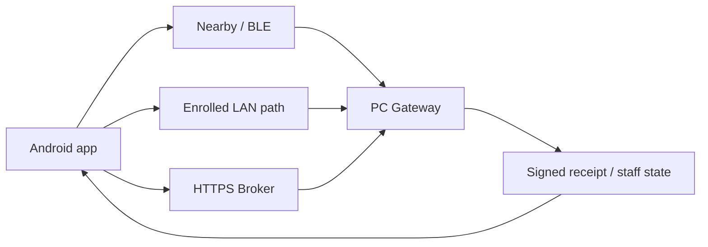

# Relay trust boundaries

The arrows below show data movement, not automatic trust. Every boundary must
be treated as hostile unless the relevant authentication, authorization,
integrity, and readiness evidence says otherwise.

## Boundary table

| Boundary | What may cross it | What is not trusted by default |
|---|---|---|
| Android → local storage | Encrypted rescue envelope, delivery metadata, consented location | Filesystem backups, unlocked host, debug storage, and device compromise |
| Android → Nearby/BLE | Bounded protocol frames, manifests, opaque envelopes, acknowledgements | Peer identity, availability, ordering, and confidentiality of metadata |
| Android → LAN Gateway | Enrolled protocol data and path-specific credentials/signatures | Discovery beacons, arbitrary LAN clients, and network confidentiality without TLS/authentication |
| Android → HTTPS Broker | Registration proof, scoped upload request, encrypted envelope | Broker confidentiality, availability, honesty, and resistance to traffic analysis |
| Broker → PC Gateway | Scoped pull results, receipts/manifests where applicable | Response freshness and availability without local validation |
| PC Gateway → staff browser | Authenticated, role-filtered views and actions | Browser host, operator decisions, and any reverse proxy configured incorrectly |
| Gateway → Android | Signed receipts and supported state updates | Unsigned or untrusted status claims, unsupported versions, and downgraded state |
| Repository/CI → release artifact | Source, dependencies, test results, build metadata | Runner compromise, unreviewed dependencies, unsigned credentials, and unverified external services |

## Trust anchors

The repository contains protocol verification logic and example/global
configuration, but it does not contain an organization-owned production trust
root, shelter directory, emergency-service credential, or formal deployment
approval. Regional trust data must be provisioned by an explicitly responsible
authority and verified before any operational claim is made.

## Review rule

When adding a transport, storage backend, integration, or release path, update
this document and the threat model with:

1. the data crossing the new boundary;
2. the identity and key used to authenticate it;
3. authorization and replay/downgrade behavior;
4. malformed-input and failure-path tests;
5. logging and privacy implications;
6. the evidence needed before readiness can change.
